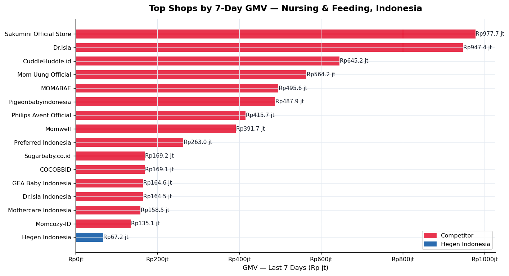
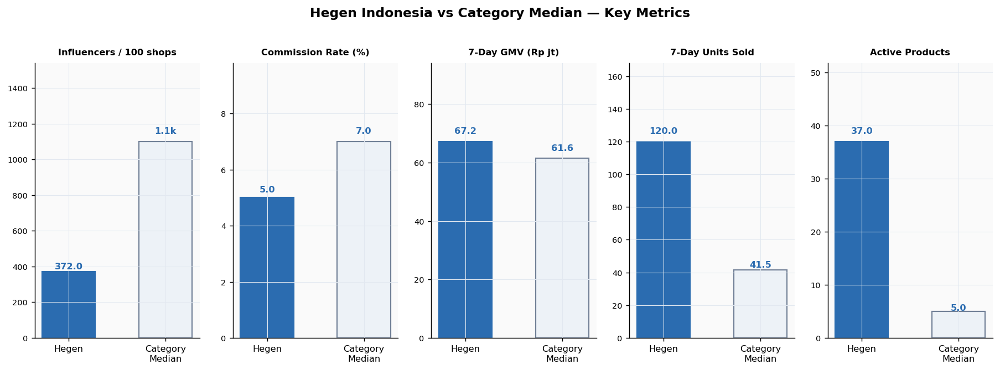
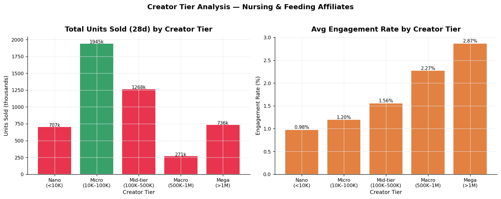
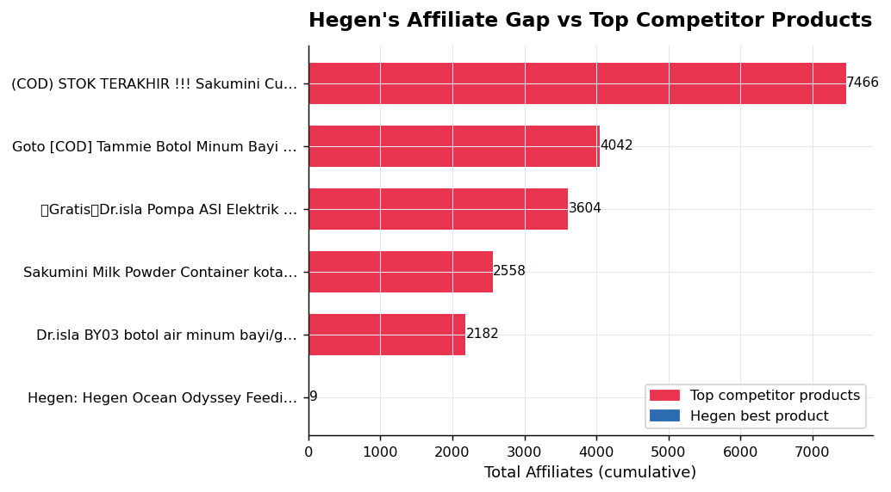

# TikTok Shop Indonesia — Nursing & Feeding Category Analysis

**Brand Spotlight: Hegen Indonesia | March 2026**

A data analytics project examining the **Nursing & Feeding** subcategory on TikTok Shop Indonesia, benchmarking Hegen Indonesia against category incumbents to surface strategic growth opportunities.

---

## Project Overview

| Item | Detail |
|------|--------|
| **Platform** | TikTok Shop Indonesia |
| **Category** | Baby & Maternity → Nursing & Feeding |
| **Brand Focus** | Hegen Indonesia (Singapore-origin premium feeding bottles) |
| **Data Source** | FastMoss (estimated sales, affiliate, and creator data) |
| **Analysis Date** | March 2026 |
| **Dataset Size** | 10 exports · ~3,000 rows |

---

## Repository Structure

```
├── data/                        # Raw FastMoss exports (xlsx)
│   ├── Shop_list__Nursing___Feeding_.xlsx
│   ├── Top_selling_shops__Nursing___Feeding_.xlsx
│   ├── Top_selling_products__Nursing___Feeding_.xlsx
│   ├── Most_promoted_products__Nursing___Feeding_.xlsx
│   ├── Video-promoted_products__Nursing___Feeding_.xlsx
│   ├── Creator_search__Nursing___Feeding_.xlsx
│   ├── Fastest_growing_creators__Baby_.xlsx
│   ├── Top_sales-driving_creators__Nursing___Feeding_.xlsx
│   ├── Trending_creators__Baby_.xlsx
│   └── Rising_star_creators__Baby_.xlsx
│
├── charts/                      # Output charts (PNG)
│   ├── 01_top_shops_gmv.png
│   ├── 02_gmv_vs_mom_growth.png
│   ├── 03_subcategory_units.png
│   ├── 04_commission_distribution.png
│   ├── 05_top_products_affiliates.png
│   ├── 06_price_vs_units_bottles.png
│   ├── 07_creator_tier_analysis.png
│   ├── 08_video_vs_live_gmv.png
│   ├── 09_creator_gmv_efficiency.png
│   ├── 10_hegen_vs_benchmark.png
│   └── 11_hegen_affiliate_gap.png
│
├── hegen_analysis.py            # Main analysis script
├── hegen_category_dashboard.xlsx  # Excel dashboard (5 sheets)
├── Hegen_TikTokShop_CategoryReport.docx  # Full business report
└── README.md
```

---

## Key Findings

- **Category leader GMV (7d):** Sakumini Official Store at Rp977.7 jt — 14.5× Hegen's figure
- **Hegen GMV trend:** -59.9% MoM — accelerating decline requiring immediate action
- **Affiliate gap:** Hegen's best product has **9 affiliates** vs. the top competitor's **7,466**
- **Commission gap:** Hegen offers **5%** vs. the category median of **7%**
- **Best creator tier:** Micro-creators (10K–100K followers) drive the most total units in the category
- **Live commerce opportunity:** 18%+ of top-creator GMV is live — Hegen has zero live presence

---

## Strategic Recommendations

1. **Raise commission to 9%** on top 3 SKUs to improve affiliate recruitment economics
2. **Launch live commerce** with 1–2 mid-tier Baby creators for weekly selling sessions
3. **Run a micro-creator seeding programme** — target 50 new affiliates in 30 days

---

## Charts Preview

### Top Shops by 7-Day GMV


### Hegen vs Category Benchmark


### Creator Tier Analysis


### Affiliate Gap


---

## How to Run the Analysis

### Requirements
```bash
pip install pandas matplotlib openpyxl
```

### Run
```bash
# Place all xlsx files from data/ in the same directory as the script
python hegen_analysis.py
```

This generates all 11 charts as PNG files in the same directory.

---

## Data Notes

- All sales figures are **FastMoss estimates**, not verified actuals. FastMoss models sales from affiliate commission data, view counts, and engagement signals.
- Two shops — **Glodok123** and **RayyanzaShopID** — show 300M%+ MoM growth. These are **data anomalies** caused by near-zero prior-month baselines and are excluded from trend analysis.
- Data reflects a snapshot from approximately **March 12, 2026**.

---

## Skills Demonstrated

- Python data cleaning and analysis (`pandas`, `matplotlib`)
- Handling real-world messy data: IDR currency strings, K/M notation, percentage fields
- Anomaly detection and exclusion from trend analysis
- Excel dashboard design (KPI cards, pivot tables, conditional formatting)
- Business report writing structured for an ops/category team audience
- E-commerce category analysis framework: GMV, affiliate coverage, creator tier segmentation

---

*Built as a portfolio project for TikTok Shop Category Data Analyst internship applications.*
